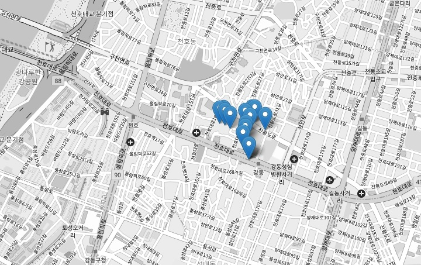

## Search

### POI nearby search by coord

It returns N-th nearby points from the given coordinate.

```http
GET http://127.0.0.1:5680/db/poi/nearby?la=37.5990998&lo=126.9861493&n=3
```

**params**

- `la` Lat
- `lo` Lon
- `n` max result count

**response**

```json
[
    {"area_code":"11110", "area_nm":"종로구", "dist":0, "la":37.5991, "lo":126.986149},
    {"area_code":"11290", "area_nm":"성북구", "dist":3381, "la":37.606991, "lo":127.023218},
    {"area_code":"11140", "area_nm":"중구", "dist":4630, "la":37.557945, "lo":126.99419}
]
```

### POI nearby search by area_code

It returns Nth nearby points from the given `area_code`.

```http
GET http://127.0.0.1:5680/db/poi/nearby?area_code=11140&n=3
```

**params**

- `area_code` Area Code
- `n` max result count

**response**

```json
[
    {"area_code":"11110", "area_nm":"종로구", "dist":0, "la":37.5991, "lo":126.986149},
    {"area_code":"11290", "area_nm":"성북구", "dist":3381, "la":37.606991, "lo":127.023218},
    {"area_code":"11140", "area_nm":"중구", "dist":4630, "la":37.557945, "lo":126.99419}
]
```

### POI nearby search by modl_serial, trnsmit_server_no, data_no

```http
GET http://127.0.0.1:5680/db/poi/nearby?modl_serial=0000000032&trnsmit_server_no=3&data_no=1&n=5
```

**params**

- `modl_serial`
- `trnsmit_server_no`
- `data_no`

**response**

```json
[
    {"adres":"강동구 천호동 571", "adres_detail":"천호 이스트센트럴타워 근생용", "buld_nm":"천호 이스트센트럴타워 근생용", "data_no":1, "dist":0, "instl_floor":0, "instl_ho_no":0, "la":37.537959, "lo":127.131604, "modl_serial":"0000000032", "trnsmit_server_no":3},
    {"adres":"강동구 천호동 571", "adres_detail":"천호 이스트센트럴타워 업무시설", "buld_nm":"천호 이스트센트럴타워 업무시설", "data_no":1, "dist":42, "instl_floor":0, "instl_ho_no":0, "la":37.537687, "lo":127.131948, "modl_serial":"0000000236", "trnsmit_server_no":3},
    {"adres":"강동구 천호동 571", "adres_detail":"강동 팰리스아파트(래미안) 상가용", "buld_nm":"강동 팰리스아파트(래미안) 상가용", "data_no":1, "dist":50, "instl_floor":0, "instl_ho_no":0, "la":37.538164, "lo":127.132119, "modl_serial":"0000000206", "trnsmit_server_no":3},
    {"adres":"서울특별시 강동구 천호대로 1077", "adres_detail":"101동 1층(천호동, 래미안강동팰리스)", "buld_nm":"구립꿈마루어린이집", "data_no":1, "dist":73, "instl_floor":1, "instl_ho_no":1, "la":37.537296, "lo":127.131626, "modl_serial":"A1E33C002809", "trnsmit_server_no":123},
    {"adres":"강동구 천호동 571", "adres_detail":"강동 팰리스아파트(래미안)", "buld_nm":"강동 팰리스아파트(래미안)", "data_no":1, "dist":64, "instl_floor":0, "instl_ho_no":0, "la":37.538164, "lo":127.132291, "modl_serial":"0000000223", "trnsmit_server_no":3}
]
```

## Render the search results on the MAP

To debug visually the search result on the MAP, add `&html=true` query parameter.

e.g.) http://127.0.0.1:5680/db/poi/nearby?modl_serial=0000000032&trnsmit_server_no=3&data_no=1&n=15&html=true




## Reload POI Database

```http
POST http://127.0.0.1:5680/db/admin/reload?target=poi
```