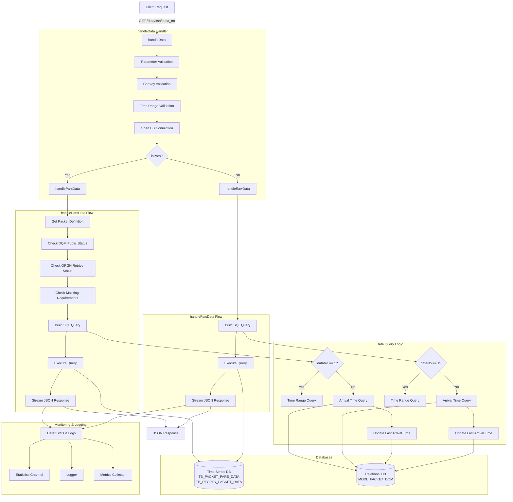
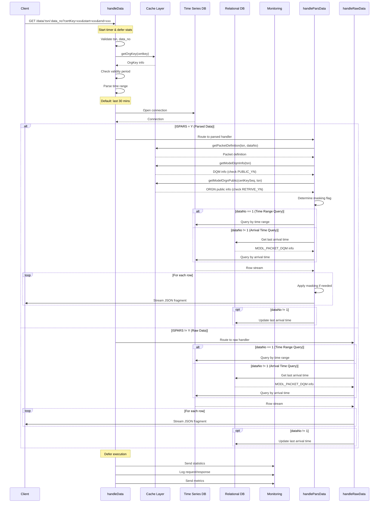
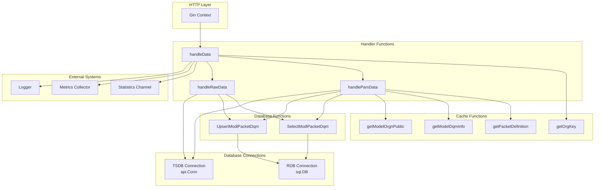
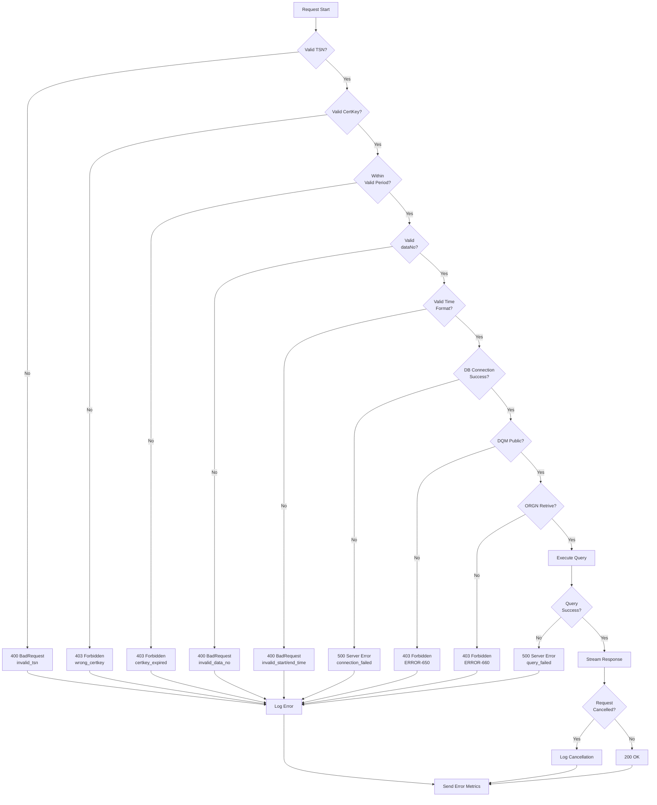
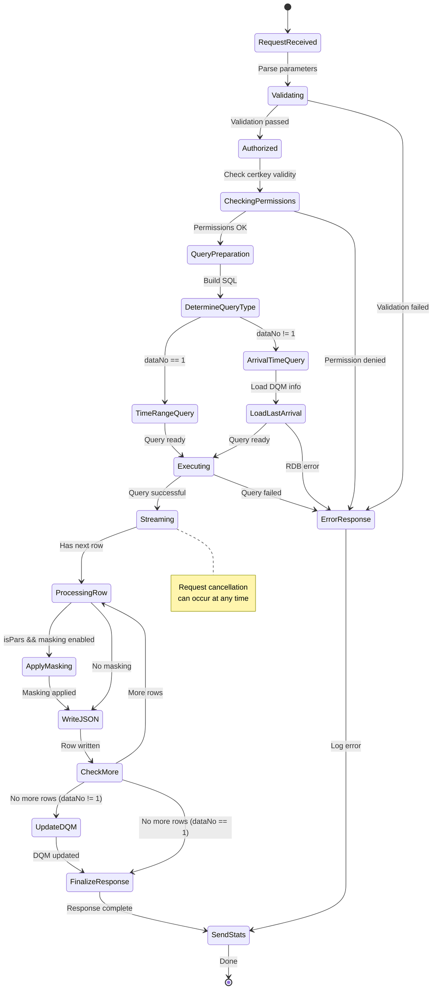

# h_data.go API Design Documentation

## 1. Overview
데이터 조회 API의 핵심 구현을 담당하는 핸들러로, Raw 데이터와 파싱된 데이터 조회를 지원합니다.

## 2. Architecture Diagram



## 3. Sequence Diagram



## 4. Data Flow Diagram

```mermaid
flowchart LR
    subgraph "Input Parameters"
        PathParams[Path Parameters<br/>tsn, data_no]
        QueryParams[Query Parameters<br/>certKey, start, end<br/>modelSerial, areaCode<br/>ISPARS, RQSRC]
    end
    
    subgraph "Validation Layer"
        V1[Validate TSN]
        V2[Validate CertKey]
        V3[Validate Time Range]
        V4[Validate dataNo]
    end
    
    subgraph "Authorization Layer"
        A1[Check OrgKey<br/>Validity Period]
        A2[Check DQM<br/>PUBLIC_YN]
        A3[Check ORGN<br/>RETRIVE_YN]
        A4[Determine<br/>Masking Flag]
    end
    
    subgraph "Query Strategy"
        Q1{dataNo == 1?}
        Q2[Time Range Query<br/>REGIST_DT based]
        Q3[Arrival Time Query<br/>_ARRIVAL_TIME based]
        Q4[Apply LIMIT if set]
    end
    
    subgraph "Data Processing"
        P1{isPars?}
        P2[Process Parsed Data<br/>with Definition]
        P3[Process Raw Data<br/>Packet String]
        P4[Apply Masking<br/>if Required]
    end
    
    subgraph "Output Layer"
        O1[Stream JSON<br/>Response]
        O2[Update Statistics]
        O3[Update DQM<br/>Last Arrival Time]
    end
    
    PathParams --> V1
    QueryParams --> V2
    V1 --> V3
    V2 --> A1
    V3 --> V4
    V4 --> A2
    
    A1 --> A2
    A2 --> A3
    A3 --> A4
    
    A4 --> Q1
    Q1 -->|Yes| Q2
    Q1 -->|No| Q3
    Q3 --> Q4
    
    Q2 --> P1
    Q4 --> P1
    
    P1 -->|Yes| P2
    P1 -->|No| P3
    
    P2 --> P4
    P4 --> O1
    P3 --> O1
    
    O1 --> O2
    O1 --> O3
```



## 5. Component Interaction



## 6. Error Handling Flow



## 7. State Diagram



## 8. Key Implementation Details

### 8.1 Time Range Logic
```
IF start == "" && end == "":
    endTime = now
    startTime = now - 30 minutes
ELSE IF start == "" && end != "":
    IF modelSerial == "":
        startTime = endTime - 60 minutes
    ELSE:
        startTime = endTime - 30 minutes
ELSE IF start != "" && end == "":
    endTime = startTime + 60 minutes
```

### 8.2 Data Query Strategy
- **dataNo = 1**: Time range query using `REGIST_DT`
- **dataNo = 2 or 3**: Arrival time query using `_ARRIVAL_TIME` with DQM tracking

### 8.3 Masking Logic
```
activateMasking = dqmInfo.Masking OR orgnPublic.Masking

IF value[0] == InvalidValueMarker:
    IF activateMasking:
        value = repeat(MaskingStrValue, width)
    ELSE:
        value = value[1:]  // Remove marker
```

### 8.4 Response Streaming
- Uses chunked JSON streaming for memory efficiency
- Supports request cancellation via context
- No buffering of entire result set

### 8.5 Statistics & Monitoring
- Request/response logging with latency
- Query statistics per organization
- Metrics collection (count, latency, errors)
- SQL query logging in debug mode

## 9. Database Schema References

### 9.1 Time Series Tables
- `TB_PACKET_PARS_DATA`: Parsed packet data
- `TB_RECPTN_PACKET_DATA`: Raw packet data

### 9.2 Relational Tables
- `MODL_DQM_INFO`: Data quality metadata
- `MODL_ORGN_PUBLIC`: Organization access control
- `MODL_PACKET_DQM`: Last arrival time tracking

## 10. API Contract

### Request
```
GET /data/:tsn/:data_no?certKey=xxx&start=yyyymmddHHMMSS&end=yyyymmddHHMMSS&modelSerial=xxx&areaCode=xxx&ISPARS=Y
```

### Response (Success)
```json
{
  "dataNo": "1",
  "datasetNo": "123",
  "resultCode": "SUCC-000",
  "resultMsg": "조회 완료",
  "startDateTime": "20231201120000",
  "endDateTime": "20231201130000",
  "resultdata": [...]
}
```

### Error Codes
- `400 BadRequest`: Invalid parameters
- `403 Forbidden`: Authentication/authorization failed
- `404 NotFound`: Resource not found
- `500 InternalServerError`: Server error
