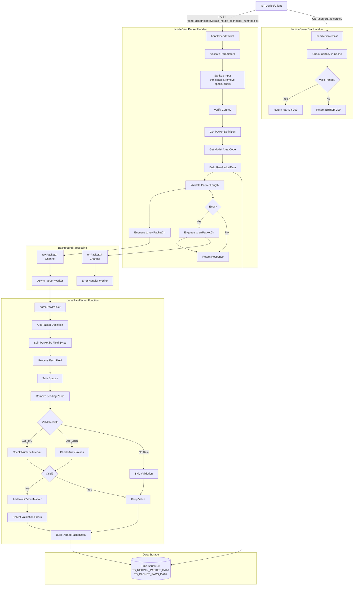
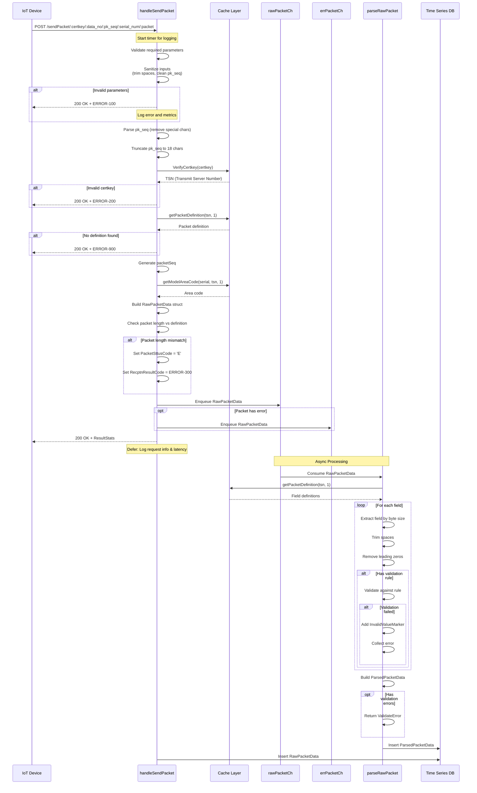
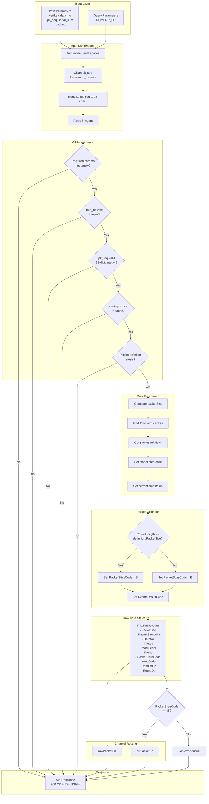
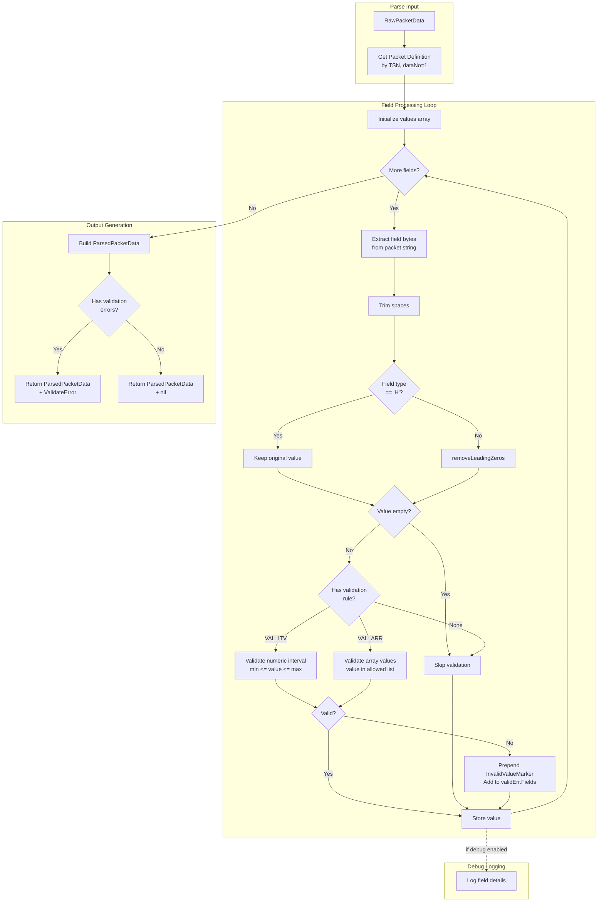
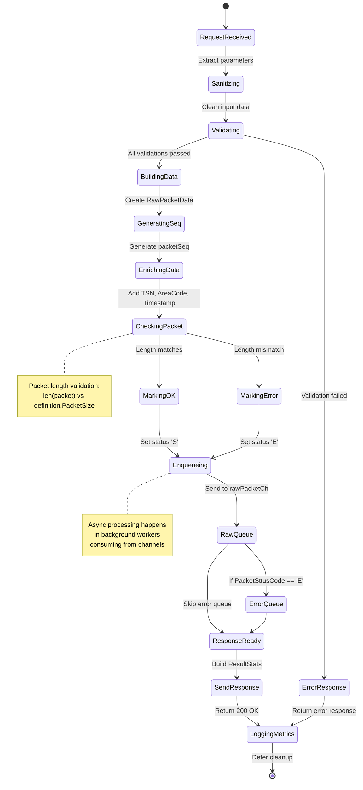
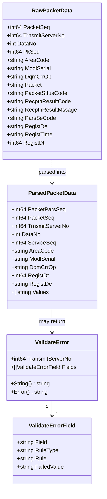
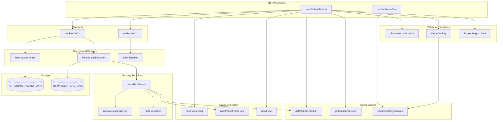

# h_packet.go API Design Documentation

## 1. Overview
패킷 수신 및 파싱 API의 핵심 구현을 담당하는 핸들러로, IoT 디바이스로부터 전송되는 Raw 패킷을 수신하고 검증 및 파싱 작업을 수행합니다.

## 2. Architecture Diagram



## 3. Sequence Diagram



## 4. Data Flow Diagram



## 5. Packet Parsing Flow



## 6. removeLeadingZeros Logic

```mermaid
flowchart TB
    Start[Input: string s]
    
    Start --> CheckEmpty{s empty?}
    CheckEmpty -->|Yes| ReturnEmpty[Return empty string]
    
    CheckEmpty -->|No| CheckX{First char<br/>'x' or 'X'?}
    CheckX -->|Yes| TrimX[Trim all leading x/X]
    TrimX --> CheckAfterX{Result empty?}
    CheckAfterX -->|Yes| ReturnEmpty
    CheckAfterX -->|No| ContinueX[Continue processing]
    
    CheckX -->|No| CheckNumeric{Is numeric<br/>pattern?}
    
    CheckNumeric -->|No| TrimZerosNonNum[Trim leading '0'<br/>for non-numeric]
    TrimZerosNonNum --> Return[Return result]
    
    CheckNumeric -->|Yes| ExtractSign[Extract sign<br/>+/- prefix]
    ExtractSign --> CheckDecimal{Has decimal<br/>point?}
    
    CheckDecimal -->|Yes| SplitDecimal[Split by '.']
    SplitDecimal --> TrimIntPart[Trim leading zeros<br/>from integer part]
    TrimIntPart --> CheckZeroInt{Integer part<br/>empty?}
    CheckZeroInt -->|Yes| SetZero[Set integer part = "0"]
    CheckZeroInt -->|No| KeepInt[Keep trimmed int]
    SetZero --> CombineDecimal[Combine: sign + int + "." + decimal]
    KeepInt --> CombineDecimal
    CombineDecimal --> Return
    
    CheckDecimal -->|No| TrimInteger[Trim leading zeros]
    TrimInteger --> CheckResult{Result empty?}
    CheckResult -->|Yes| HandleZero{Has sign<br/>+/- ?}
    HandleZero -->|Yes| ReturnSignZero[Return sign + "0"]
    HandleZero -->|No| ReturnZero[Return "0"]
    CheckResult -->|No| CombineSign[Combine: sign + trimmed]
    
    ReturnSignZero --> Return
    ReturnZero --> Return
    CombineSign --> Return
    ContinueX --> CheckNumeric
```

## 7. State Diagram



## 8. Validation Error Structure



## 9. Component Interaction



## 10. Error Handling Matrix

```mermaid
flowchart TD
    Start[Request Start]
    
    Start --> E1{Empty<br/>parameters?}
    E1 -->|Yes| R1[200 OK + ERROR-100<br/>empty_params]
    
    E1 -->|No| E2{Invalid<br/>data_no?}
    E2 -->|Yes| R2[200 OK + ERROR-100<br/>invalid_data_no]
    
    E2 -->|No| E3{Invalid<br/>pk_seq?}
    E3 -->|Yes| R3[200 OK + ERROR-100<br/>invalid_pk_seq]
    
    E3 -->|No| E4{Wrong<br/>certkey?}
    E4 -->|Yes| R4[200 OK + ERROR-200<br/>wrong_certkey]
    
    E4 -->|No| E5{No packet<br/>definition?}
    E5 -->|Yes| R5[200 OK + ERROR-900<br/>no_modl_detail]
    
    E5 -->|No| E6{Packet length<br/>mismatch?}
    E6 -->|Yes| R6[200 OK + ERROR-300<br/>invalid_packet]
    
    E6 -->|No| Success[200 OK + SUCC-000]
    
    R1 --> Log[Log error + metrics]
    R2 --> Log
    R3 --> Log
    R4 --> Log
    R5 --> Log
    R6 --> Log
    Success --> Log
    
    note right of R1
        All responses return
        HTTP 200 OK status.
        Error info is in
        ResultStats JSON.
    end note
```

## 11. Key Implementation Details

### 11.1 pk_seq Sanitization
```go
// Remove special characters: - _ : space
// Truncate to 18 characters max
pkSeqStr = strings.Map(func(r rune) rune {
    if r == '-' || r == '_' || r == ':' || r == ' ' {
        return -1
    }
    return r
}, pkSeqStr)
maxPkSeqLen := 18
if len(pkSeqStr) > maxPkSeqLen {
    pkSeqStr = pkSeqStr[:maxPkSeqLen]
}
```

### 11.2 Validation Rules

**VAL_ITV (Interval Validation)**
- Check if value is numeric
- Check if value is within [MinValue, MaxValue]
- Mark invalid values with `InvalidValueMarker`

**VAL_ARR (Array Validation)**
- Check if value exists in comma-separated allowed list
- Mark invalid values with `InvalidValueMarker`

### 11.3 Invalid Value Marking
```go
// Prepend marker for invalid values
val = string(InvalidValueMarker) + val

// Later processing can detect and handle marked values
if len(value) > 0 && value[0] == InvalidValueMarker {
    // Handle invalid value (e.g., masking)
}
```

### 11.4 Channel-based Async Processing
```go
// Enqueue to raw packet channel (always)
s.rawPacketCh <- &data

// Enqueue to error channel (only if error)
if data.RecptnResultCode != ApiReceiveSuccess.ResultStats.ResultCode {
    s.errPacketCh <- &data
}
```

### 11.5 Response Format
All responses return HTTP 200 OK with error information in JSON:
```json
{
  "resultStats": {
    "resultCode": "SUCC-000",
    "resultMsg": "수신 완료"
  }
}
```

### 11.6 Packet Status Codes
- `S`: 정상 (OK)
- `E`: 오류 (Error)

### 11.7 Parse Code
- `A`: 자동 (Auto)
- `M`: 수동 (Manual)

## 12. API Contract

### 12.1 Send Packet API

**Request**
```
POST /sendPacket/:certkey/:data_no/:pk_seq/:serial_num/:packet
Query params: DQMCRR_OP (optional)
```

**Response (Success)**
```json
{
  "resultStats": {
    "resultCode": "SUCC-000",
    "resultMsg": "수신 완료"
  }
}
```

**Response (Invalid Packet Length)**
```json
{
  "resultStats": {
    "resultCode": "ERROR-300",
    "resultMsg": "패킷 형식이 올바르지 않습니다 패킷정의길이:100(H:20/T:80),수신패킷길이:95"
  }
}
```

### 12.2 Server Status API

**Request**
```
GET /serverStat/:certkey
```

**Response (Ready)**
```json
{
  "resultStats": {
    "resultCode": "READY-000",
    "resultMsg": "수신 가능"
  }
}
```

**Response (Invalid Certkey)**
```json
{
  "resultStats": {
    "resultCode": "ERROR-200",
    "resultMsg": "인증키가 올바르지 않습니다."
  }
}
```

## 13. Performance Considerations

### 13.1 Async Processing
- Raw packet data immediately enqueued to channel
- Response returned without waiting for parsing
- Background workers handle parsing and storage

### 13.2 Input Sanitization
- Trim spaces from serial numbers
- Clean pk_seq format variations
- Truncate oversized inputs

### 13.3 Logging Strategy
- Defer function captures timing and status
- Debug mode provides detailed field parsing logs
- Error logging includes request details

### 13.4 Memory Management
- Stream-based packet field extraction
- No buffering of entire packet list
- Validation errors collected incrementally
